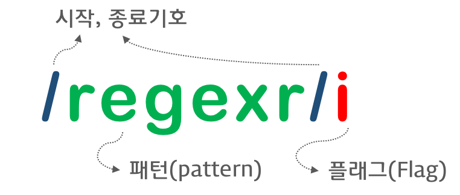

## 5.23 Number 레퍼 객체


### 1. 원시 타입이 wrapper 객체의 메소드를 사용할 수 있는 이유?

원시 타입으로 프로퍼티나 메소드를 호출할 때 원시 타입과 연관된 wrapper 객체로 일시적으로 변환되어 프로토타입 객체를 공유하게 되기 때문이다.

```javascript
var num = 1.5;
console.log(num.toFixed()); // 2
```


### 2. Number Constructor


Number 객체는 Number() 생성자 함수를 통해 생성할 수 있다.

```javascript
new Number(value);
```


만약 인자가 숫자로 변환될 수 없다면  NaN을 반환한다.

```javascript
var z = new Number('str');
console.log(z); // NaN
```


Number()생성자 함수를 new 연산자를 붙이지 않아 생성자로 사용하지 않으면 Number 객체를 반환하지 않고 원시 타입 숫자를 반환함.

```javascript
var x = Number('123');
console.log(typeof x, x);
```


일반적으로 숫자를 사용할 때는 원시 타입 숫자를 사용한다.

```javascript
var x = 123;
var y = new Number(123);

console.log(x == y); // true
console.log(x === y); // false

console.log(typeof x); // number
console.log(typeof y); // object
```


### 3. Number Property

정적 프로퍼티로 Number 객체를 생성할 필요 없이 Number.propertyName 형태로 사용함.


#### 3.1 Number.EPSILON

Number/EPSILON은 JavaScript에서 표현할 수 있는 가장 작은 수 

 

부동소주점의 비교는 Number.EPSILON 을 사용하여 비교 기능을 갖는 함수를 작성함

```javascript
console.log(0.1 + 0.2);
console.log(0.1 + 0.2 == 0.3);

function isEqual(a, b) {
	// Math.abs는 절댓값을 반환한다.
	// 즉 a와 b의 차이가 JavaScript에서 표현할 수 있는 가장 작은 수인 Number.EPSILON보다 작으면 같은 		수로 인정할 수 있다.
	return Math.abs(a - b) < Number.EPSILON;
}

console.log(isEqual(0.1 + 0.2, 0.3));
```


#### 3.2 Number.MAX_VALUE 


자바스크립트에서 사용 가능한 가장 큰 숫자를 반환한다. 

MAX_VALUE보다 큰 숫자는 Infinity이다.

```javascript
Number.MAX_VALUE;

var num = 10;
num.MAX_VALUE; // undefined

console.log(Infinity > Number.MAX_VALUE); //true
```


#### 3.3 Number.MIN_VALUE


자바스크립트에서 사용 가능한 가장 작은 숫자를 반환한다.

MIN_VALUE는 0에 가장 가까운 양수 값이다. MIN_VALUE보다 작은 숫자는 0으로 변환된다.

```javascript
Number.MIN_VALUE;

var num = 10;
num.MIN_VALUE; // undefined

console.log(Number.MIN_VALUE > 0); // true
console.log(Number.MIN_VALUE < Number.EPSILON); // true
```


#### 3.4 Number.POSITIVE_INFINITY

양의 무한대 Infinity를 반환한다.

```javascript
Number.POSITIVE_INIFINITY // Infinity

var num = 10;
num.POSITIVE_INFINITY; // undefined

```


#### 3.5 Number.NEGATIVE_INFINITY

음의 무한대 -Infinity를 반환한다.

```javascript
Number.NEGATIVE_INFINITY // -Infinity

var num = 10;
num.NEGATIVE_INFINITY; // undefined

```


#### 3.6 Number.NaN

숫자가 아님(Not-a-Number) 을 나타내는 숫자값이다.  Number.NaN 프로퍼티는 window.NaN 프로퍼티와 같다.

```javascript
console.log(Number('xyz'));
console.log(1 * 'string');
console.log(typeof NaN);

```


### 4. Number Method


#### 4.1 Number.isFinite(testValue: number) : boolean 

매개변수에 전달된 값이 정상적인 유한수인지를 검사하여 그 결과를 Boolean으로 반환함.

```javascript
Number.isFinite(testValue)
Number.isFinite(Infinity) // false
Number.isFinite(NaN) // false
Number.isFinite('Hello') // false
Number.isFinite('2005/12/12') // false

Number.isFinite(0) // true
Number.isFinite(2e64) // true
Number.isFinite(null) // false.
isFinite(null) // true

```


Number.isFinite()는 전역 함수 isFinite()와 차이가 있다. 전역 함수 isFinite()는 인수를 숫자로 변환하여 검사를 수행하지만  Number.isFinite()는 인수를 변환하지 않는다. 따라서 숫자가 아닌 인수가 주어졌을 때 반환값은 언제나 false이다.


#### 4.2 Number.isIniteger(testValue: number) : boolean 

매개변수에 전달된 값이 정수인지 검사하여 그 결과를 Boolean으로 반환한다. 검사전에 인수를 숫자로 변환하지 않는다.

```javascript
Number.isInteger(testValue)

Number.isInteger(123) // true
Number.isInteger(-123) // true
Number.isInteger(5-2) // true
Number.isInteger(0) // true
Number.isInteger(0.5) // false
Number.isInteger('123') // false
Number.isInteger(false) // false
Number.isInteger(Infinity) // false
Number.isInteger(-Infinity) // false
Number.isInteger(0 / 0) // false

```


#### 4.3 Number.isNaN(testValue: number): boolean

매개변수에 전달된 값이 NaN인지를 검사하여 그 결과를 Boolean으로 반환한다.

```javascript
Number.isNaN(testValue)
Number.isNaN(NaN) // true
Number.isNaN(undefined) // false
Number.isNaN({}) // false 
Number.isNaN('blabla') // false 

Number.isNaN(true) // false
Number.isNaN(null) // false
Number.isNaN(37) // false
Number.isNaN('37') // false
Number.isNaN('37.37'); // false
Number.isNaN(''); // false
Number.isNaN(' '); // false
Number.isNaN(new Date()) // false
Number.isNaN(new Date().toString()) // false

```

Number.isNaN()는 전역 함수 isNan()와 차이가 있다.

isNaN()는 인수를 숫자로 변환하여 검사를 수행 / Number.isNaN()는 인수를 변환하지 않는다.


#### 4.4 Number.isSafeInteger(testValue: number): boolean

매개변수에 전달된 값이 안전한 정수값인지 검사하여 그 결과를 Boolean으로 반환한다. 

```javascript
Number.isSafeInteger(testValue)
Number.isSafeInteger(123) // true
Number.isSafeInteger(-123) // true
Number.isSafeInteger(5-2) // true
Number.isSafeInteger(0) // true
Number.isSafeInteger(1000000000000000) // true
Number.isSafeInteger(10000000000000001) // false
Number.isSafeInteger(0.5) // false
Number.isSafeInteger('123') // false
Number.isSafeInteger(false) //false
Number.isSafeInteger(Infinity) //false
Number.isSafeInteger(-Infinity) //false
Number.isSafeInteger(0 / 0) //false

```


#### 4.5 Number.prototype.toExponential(fractionDigits?: number): string

대상을 지수 표기법으로 변환하여 문자열로 반환한다.

지수 표기법이란 매우 큰 숫자를 표기할 때 주로 사용하며 e 앞에 있는 숫자에 10의 n승을 곱하는 형식으로 수를 나타내는 방식임.


```javascript
numObj = toExponential([fractionDigits])
var numObj = 77.1234;

console.log(numObj.toExponential()); // logs 7.71234e+1
console.log(numObj.toExponential(4)); //logs 7.7123e+1

```


#### 4.6 정수 리터럴과 함께 메소드를 사용하는 경우

숫자 뒤에 .은 의미가 모호함. 소숫점일수도 있고 객체 프로퍼티에 접근하기 위한 마침표 표기법일수도 있음.

따라서 자바스크립트 엔진은 숫자 뒤의 .을 부동 소수점 숫자의 일부로 해석한다.

```javascript
1.23.toString(); // '1.23' // 첫번째 .은 소수점 숫자의 일부, 두번째 .은 객체 프로퍼티표기법
(77).toString(); // '77' // 정수 리터럴과 함께 메소드를 사용하는 경우 ()권장
77 .toString(); // '77' // 정수 리터럴 뒤에 스페이스다음 .가 온다면 .을 마침표 표기법으로 해석함

```


#### 4.7 Number.prototype.toFixed(fractionDigits?: number): string

매개변수로 지정된 소숫점자리를 반올림하여 문자열로 반환한다.

```javascript
numObj.toFixed([fractionDigits])

var numObj = 12345.6789;

// 소숫점 이하 반올림
console.log(numObj.toFixed()); // '12346'

// 소숫점 이하 1자리수 유효, 나머지 반올림
console.log(numObj.toFixed(1)); // '12345.7'

```


#### 4.8 Number.prototype.toPrecision(precision?: number): string

매개변수로 지정된 전체 자리수까지 유효하도록 나머지 자릿수를 반올림하여 문자열로 반환한다. 지정된 전체 자릿수로 표현할 수 없는 경우 지수 표기법으로 결과를 반환함.


```javascript
numObj.toPrecision([precision])

var numObj = 15345.6789;

// 전체자리수 유효
console.log(numObj.toPrecision()); // '12345.6789'

// 전체 1자리수 유효, 나머지 반올림
console.log(numObj.toPrecision(1)); // '2e+4' 

// 전체 2자리수 유효, 나머지 반올림
console.log(numObj.toPrecision(2)); // '1.5e+4' 

```


#### 4.9 Number.prototype.toString(radix?: number): string

숫자를 문자열로 반환하여 반환한다.


```javascript
numObj.toString([radix])

var count = 10;
console.log(count.toString()); // '10'
console.log((17).toString()); // '17'
console.log(17 .tostring()); // '17'

```


#### 4.10 Number.prototype.valueOf(): number

Number 객체의 원시 타입 값을 반환한다.

```javascript
var numObj = new Number(10);
console.log(typeof number); // object

var num = numObj.valueOf();
console.log(num); // 10
console.log(typeof num); // number

```

-------------------

## 5.24 수학 상수와 함수를 위한 Math 객체 

Math 객체는 수학 상수와 함수를 위한 프로퍼티와 메소드를 제공하는 빌트인 객체이다. 

Math 객체는 생성자 함수가 아니다. 

따라서 Math 객체는 정적(static) 프로퍼티와 메소드만을 제공한다.


### 1. Math Property

#### 

#### 1.1 Math.PI

PI 값(3.14~)을 반환한다.

```javascript
Math.PI; // 3.141592 
```


### 2. Math Method


#### 2.1 Math.abs(x: number): number

인수의 절댓값(absolute value)을 반환한다. 절댓값은 반드시 0 또는 양수이어야 한다.

```javascript
Math.abs(-1); // 1
Math.abs('-1'); // 1
Math.abs(''); // 0
Math.abs([]); // 0
Math.abs(null); // 0
Math.abs(undefined); //NaN
Math.abs({}); // NaN
Math.abs('string'); //NaN
Math.abs(); // NaN
```


#### 2.2 Math.roudn(x: number): number

인수의 소숫점 이하를 반올림한 정수를 반환한다.

```javascript
Math.round(1.4); // 1
Math.round(1.6); // 2
Math.round(-1.4); // -1
Math.round(-1.6); // -2
Math.round(1); // 1
Math.round(); // NaN
```


#### 2.3 Math.ceil(x: number): number

인수의 소숫점 이하를 올림한 정수를 반환한다.

```javascript
Math.ceil(1.4); // 2
Math.ceil(1.6); // 2
Math.ceil(-1.4); // -1
Math.ceil(-1.6); // -1
Math.ceil(1); // 1
Math.ceil(); // NaN
```


#### 2.4 Math.floor(x: number): number

인수의 소수점 이하를 내림한 정수를 반환한다. Math.ceil의 반대 개념임

- 양수인 경우 , 소수점 이하를 떼어 버린 다음 정수를 반환한다.
- 음수인 경우 , 소수점 이하를 떼어 버린 다음 -1을 한 정수를 반환한다.


```javascript
Math.floor(1.9); // 1
Math.floor(9.1); // 9
Math.floor(-1.9); // -2
Math.floor(-9.1); // -10
Math.floor(1); // 1
Math.floor(); // NaN
```


#### 2.5 Math.sqrt(x: number): number

인수의 제곱근을 반환한다.

```javascript
Math.sqrt(9); // 3
Math.sqrt(-9); // NaN
Math.sqrt(2); // 1.414~
Math.sqrt(1); // 1
Math.sqrt(0); // 0
Math.sqrt(); // NaN
```


#### 2.6 Math.random(): number

임의의 부동 소수점을 반환한다. 반환된 부동 소수점은 0부터 1미만이다. 즉 0은 포함되지만 1은 포함되지 않는다.

```javascript
Math.random(); // 0 ~ 1 미만의 부동 소수점
const random = Math.floor((Math.random() * 10) + 1); // 10을 곱한후 소수점 떼어버림
console.log(random); // 1 ~ 10까지의 정수
```


#### 2.7 Math.pow(x: number, y:number): number

 첫번째 인수를 밑, 두번째 인수를 지수로 하여 거듭제곱을 반환한다.

```javascript
Math.pow(2, 8); // 256
Math.pow(2, -1); // 0.5
Math.pow(2); // NaN

// ES7(ECMAScript 2016) Exponentiation operator(거듭 제곱 연산자)
2 ** 8; // 256
```


#### 2.8 Math.max(...value: number[]): number

인수 중에서 가장 큰 수를 반환한다.

```javascript
Math.max(1, 2, 3); // 3

// 배열 요소 중에서 최대값 취득
const arr = [1, 2, 3];
const max = Math.max.apply(null, arr); // 3

// ES6 Spread operator
Math.max(...arr); // 3

```


#### 2.9 Math.min(...value: number[]): number

인수 중에서 가장 작은 수를 반환한다.

```javascript
Math.min(1, 2, 3); // 1

// 배열 요소 중에서 최소값 취득
const arr = [1, 2, 3];
const min = Math.min.apply(null, arr); // 1

// ES6 Spread operator
Math.min(...arr); // 1

```

------------------

## 5.25 날짜와 시간을 위한 Date 객체 

Date 객체는 날짜와 시간을 위한 메소드를 제공하는 빌트인 객체이면서 생성자 함수


### 1. Date Constructor

Date 생성자 함수로 객체를 생성하는 방법은 4가지가 있다.


- 종류 : 
  1. new Date()
  2. new Date(milliseconds)
  3. new Date(dateString)
  4. new Date(year, month(, day, hour, minute, second, millisecond))


#### 1.1 new Date() 

인수를 전달하지 않으면 현재 날짜와 시간을 가지는 인스턴스를 반환한다.

```javascript
const date = new Date();
console.log(date); // Thu May 16 2019 17:16:13 GMT+0900 (한국 표준시)
```


#### 1.2 new Date(milliseconds)

인수로 숫자 타입의 밀리초를 전달하면 1970년 1월 1일 00:00(UTC)을 기점으로 인수로 전달된 밀리초만큼 경과한 날짜와 시간을 가지는 인스턴스를 반환한다.

```javascript
let date = new Date(0);
console.log(date) // Thu Jan 01 1970 09:00:00 GMT+0900 (한국 표준시)

date = new Data(86400000);
console.log(date); // FFri Jan 02 1970 09:00:00 GMT+0900 (한국 표준시)
```


#### 1.3 new Date(dateString)

인수로 날짜와 시간을 나타내는 문자열을 전달하면 지정된 날짜와 시간을 가지는 인스턴스를 반환한다.

인수로 전달한 문자열은 Date.parse 메소드에 의해 해석 가능한 형식이어야 함.

```javascript
let date = new Date('May 16, 2019 17:22:10');
console.log(date); // Thu May 16 2019 17:22:10 GMT+0900 (한국 표준시)

date = new Date('2019/05/16.17:22:10');
console.log(date); // // Thu May 16 2019 17:22:10 GMT+0900 (한국 표준시)
```


#### 1.4 new Date(year, month[, day, hour, minute, second, millisecond])

인수로 년, 월 , 일, 시, 분, 초, 밀리초를 의미하는 숫자를 전달하면 지정된 날짜와 시간을 가지는 인스턴스를 반환한다. 

```javascript
let date = new Date(2019, 4);
console.log(date); // Wed May 01 2019 00:00:00 GMT+0900 (한국 표준시)

date = new Date(2019, 4, 16, 17, 24, 30, 0);
console.log(date); // Thu May 16 2019 17:24:30 GMT+0900 (한국 표준시)

// 가독성이 훨씬 좋다.
date = new Date(;2019/5/16/17:24:30:10');
console.log(date); // Thu May 16 2019 17:24:30 GMT+0900 (한국 표준시)
```


#### 1.5 Date 생성자 함수를 new 연산자 없이 호출

Date. 생성자 함수를 new  연산자없이 호출하면 인스턴스를 반환하지 않고 결과값을 문자열로 반환한다.

```javascript
let date = Date();
console.log(typeof date, date); // string Thu May 16 2019 17:33:03 GMT+0900 (한국 표준시)
```


### 2. Date 메소드


#### 2.1 Date.now

 1970년 1월 1일 00:00:00(UTC)을 기점으로 현재 시간까지 경과한 밀리초를 숫자로 반환한다. 

```javascript
const now = Date.now();
console.log(now);
```


#### 2.2 Date.parse

1970년 1월 1일 00:00: 00(UTC)을 기점으로 인수로 전달된 지정 시간가지의 밀리초를 숫자로 반환한다.

```javascript
let d = Date.parse('Jan 2, 1970 00:00:00 UTC'); // UTC
console.log(d); // 86400000

d = Date.parse('Jan 2, 1970 09:00:00'); // KST
console.log(d); // 86400000

d = Date.parse('1970/01/02/09:00:00'); // KST
console.log(d); // 86400000
```


#### 2.3 Date.UTC

1970년 1월 1일 00:00:00을 기점으로 인수로 전달된 지정 시간까지의 밀리초를 숫자로 반환함.

Date.UTC 메소드는 new Date(year, month[, day, hour, minute, second, millisecond]) 와 같은 형식의 인수를 사용해야됨.  Date.UTC 메소드의 인수는 local time(KST)가 아닌 UTC로 인식된다.


```javascript
let d = Date.UTC(1970 ,0, 2);
console.log(d); // 86400000

d = Date.UTC('1970/1/2');
console.log(d); // NaN
```


#### 2.4 Date.prototype.getFullYear

년도를 나타내는 4자리 숫자를 반환한다.

```javascript
const today = new Date();
const year = today.getFullYear();

console.log(today); // Thu May 16 2019 17:39:30 GMT+0900 (한국 표준시)
console.log(year); // 2019

```


#### 2.5 Date.prototype.setFullYear

년도를 나타내는 4자리 숫자를 설정한다. 년도 이외 월, 일도 설정할 수 있다.

```javascript
dateObj.setFullYear(year[, month[, day]]) 

const today = new Date();

// 년도 지정
today.setFullYear(2000);

let year = today.getFullYear();
console.log(today); // Tue May 16 2000 17:42:40 GMT+0900 (한국 표준시)
console.log(year); // 2000

// 년도 지정
today.setFullYear(1900, 0, 1);

year = today.getFullYear();
console.log(today); // Mon Jan 01 1900 17:42:40 GMT+0827 (한국 표준시)
console.log(year); // 1900

```

#### 

#### 2.6 Date.prototype.getMonth

월을 나타내는 0 ~ 11의 정수를 반환한다. 1월은 0, 12월은 11이다.

```javascript
const today = new Date();
const month = today.getMonth();

console.log(today); // Thu May 16 2019 17:44:03 GMT+0900 (한국 표준시)
console.log(month); // 4

```


#### 2.7 Date.prototype.setMonth

월을 나타내는 0 ~ 11의 정수를 설정한다. 1월은 0, 12월은 11이다. 월 이외 일도 설정할 수 있다.

```javascript
dateObj.setMonth(month[, day])

const today = new Date();

//월을 지정 
today.setMonth(0); // 1월

let month = today.getMonth();
console.log(today); // // Wed Jan 16 2019 17:45:20 GMT+0900 (한국 표준시)
console.log(month); // 0

// 월/일을 지정
today.setMotnh(11, 1); // 12월 1일

month = today.getMonth();
console.log(today); //  Sun Dec 01 2019 17:45:20 GMT+0900 (한국 표준시)
console.log(month); // 11

```


#### 2.8 Date.prototype.getDate

날짜 (1 ~ 31)를 나타내는 정수를 반환한다.

```javascript
const today = new Date();
const date = today.getDate();

console.log(today); // Thu May 16 2019 17:46:42 GMT+0900 (한국 표준시)
console.log(date); // 16

```

#### 

#### 2.9 Date.prototype.setDate

날짜(1 ~ 31)를 나타내는 정수를 설정한다.

```javascript
const today = new Date();

// 날짜 지정
today.setDate(1);

const date = today.getDate();
console.log(today); // Wed May 01 2019 17:47:01 GMT+0900 (한국 표준시)
console.log(date); // 1

```


#### 2.10 Date.prototype.getDay

요일 (0 ~ 6)를 나타내는 정수를 반환한다. 반환값은 아래와 같다.

|  요일  | 반환값 |
| :----: | :----: |
| 일요일 |   0    |
| 월요일 |   1    |
| 화요일 |   2    |
| 수요일 |   3    |
| 목요일 |   4    |
| 금요일 |   5    |
| 토요일 |   6    |

```javascript
const today = new Date();
const day = today.getDay();

console.log(today); // Thu May 16 2019 17:47:31 GMT+0900 (한국 표준시)
console.log(day); // 4

```


#### 2.11 Date.prototype.getHours

시간 (0 ~ 23)를 나타내는 정수를 반환한다.

```javascript
const today = new Date();
const hours = today.getHours();

console.log(today); // Thu May 16 2019 17:48:03 GMT+0900 (한국 표준시)
console.log(hours); // 17

```


#### 2.12 Date.prototype.setHours

시간 (0 ~ 23)를 나타내는 정수를 설정한다. 시간 이외 분, 초 밀리초도 설정할 수 있다.

```javascript
const today = new Date();

// 시간 지정
today.setHours(7);

let hours = today.getHours();
console.log(today); // // Thu May 16 2019 07:49:06 GMT+0900 (한국 표준시)
console.log(hours); // 7

// 시간, 분, 초, 밀리초 지정
today.setHours(0, 0, 0, 0);

hours = today.getHours();
console.log(today); // Thu May 16 2019 00:00:00 GMT+0900 (한국 표준시)
console.log(hours); // 0

```


#### 2.13 Date.prototype.getMinutes

분 (0 ~ 59)를 나타내는 정수를 반환한다.

```javascript
const today = new Date();
const minutes = today.getMinutes();

console.log(today); // Thu May 16 2019 17:50:29 GMT+0900 (한국 표준시)
console.log(minutes); // 50

```


#### 2.14 Date.prototype.setMinutes

분 (0 ~ 59)를 나타내는 정수를 설정한다. 분 이외 초, 밀리초도 설정할 수 있다.

```javascript
const today = new Date();

// 분 지정
today.setMinutes(50);

let minutes = today.getMinutes();
console.log(today);   // Thu May 16 2019 17:50:30 GMT+0900 (한국 표준시)
console.log(minutes); // 50

// 분/초/밀리초 지정
today.setMinutes(5, 10, 999); // HH:05:10:999

minutes = today.getMinutes();
console.log(today);   // Thu May 16 2019 17:05:10 GMT+0900 (한국 표준시)
console.log(minutes); // 5

```


#### 2.15 Date.prototype.getSeconds

초를 나타내는 정수를 반환한다.

```javascript
const today = new Date();
const seconds = today.getSeconds();

console.log(today); // Thu May 16 2019 17:53:17 GMT+0900 (한국 표준시)
console.log(seconds); // 17 

```


#### 2.16 Date.prototype.setSeconds

초를 나타내는 정수를 설정한다. 초 이외 밀리초도 설정할 수 있다.

```javascript
const today = new Date();

// 초 지정
today.setSeconds(30);

let seconds = today.getSeconds();
console.log(today);   // Thu May 16 2019 17:54:30 GMT+0900 (한국 표준시)
console.log(seconds); // 30

// 초/밀리초 지정
today.setSeconds(10, 0); // HH:MM:10:000

seconds = today.getSeconds();
console.log(today);   // Thu May 16 2019 17:54:10 GMT+0900 (한국 표준시)
console.log(seconds); // 10

```


#### 2.17 Date.prototype.getMilliseconds

밀리초를 나타내는 정수를 반환한다.

```javascript
const today = new Date();
const ms = today.getMilliseconds();

console.log(today);
console.log(ms);

```


#### 2.18 Date.prototype.setMilliseconds

밀리초를 나타내는 정수를 설정한다.

```javascript
const today = new Date();

// 밀리초 지정
today.setMilliseconds(123);

const ms = today.getMilliseconds();
console.log(today); // Thu May 16 2019 17:55:45 GMT+0900 (한국 표준시)
console.log(ms);    // 123

```


#### 2.19 Date.prototype.getTime

 1970년 1월 1일 00:00:00(UTC)를 기점으로 현재 시간까지 경과된 밀리초를 반환한다. 

```javascript
const today = new Date();
const time = today.getTime();

console.log(today); // Thu May 16 2019 17:56:08 GMT+0900 (한국 표준시)
console.log(time); // 1557996968335

```


#### 2.20 Date.prototype.setTime

1970년 1월 1일 00:00:00(UTC)를 기점으로 현재 시간까지 경과된 밀리초를 설정한다.

```javascript
const today = new Date();

today.setTime(86400000);

const time = today.getTime();
console.log(today); // Fri Jan 02 1970 09:00:00 GMT+0900 (한국 표준시)
console.log(time); // 86400000


```


#### 2.21 Date.prototype.getTimezoneOffset

UTC와 지정 로케일 시간과의 차이를 분단위로 반환한다.


#### 2.22 Date.prototype.toDateString

사람이 읽을 수 있는 형식의 문자열로 날짜를 반환한다.


#### 2.24 Date.prototype.toTimeString

사람이 읽을 수 있는 형식의 문자열로 시간을 반환한다.


-----------------

## 5.26 정규 표현식


### 1. 정규표현식

정규 표현식은 문자열에서 특정 내용을 찾거나 대체 또는 발췌하는데 사용됨.

```javascript
const tel = '0101234567팔';

// 정규 표현식 리터럴
const myRegExp = /^[0-9]+$/;

console.log(myRegExp.test(tel)); // false
```


- 장점 : 
  1. 복잡한 코드도 정규 표현식을 이용하면 매우 간단하게 표현할수 있음
- 단점 :
  1. 주석이나 공백을 허용하지 않고 여러가지 기호를 혼합하여 사용하기 때문에 가독성이 좋지 않음


- 정규 표현식 리터럴 구성

  


- 정규 표현식을 사용하는 자바스크립트 메소드의 종류 : 
  1.  RegExp.prototype.exec
  2. RegExp.prototype.test
  3. String.prototype.match
  4. String.prototype.replace
  5. String.prototype.search
  6. String.prototype.split 


```javascript
const targetStr = 'This is a pen.';
const regexr = /is/ig;

// RegExp 객체의 메소드
console.log(regexr.exec(targetStr)); // [ 'is', index: 2, input: 'This is a pen.' ]
console.log(regexr.test(targetStr)); // true

// String 객체의 메소드
console.log(targetStr.match(regexr)); // [ 'is', 'is' ]
console.log(targetStr.replace(regexr, 'IS')); // ThIS IS a pen.
// String.prototype.search는 검색된 문자열의 첫번째 인덱스를 반환한다.
```


#### 1.1 플래그

플래그는 아래와 같은 종류가 있다.

| Flag | Meaning     | Description                               |
| ---- | ----------- | ----------------------------------------- |
| i    | Ignore Case | 대소문자를 구별하지 않고 검색한다.        |
| g    | Global      | 문자열 내의 몯느 패턴을 검색한다.         |
| m    | Multi Line  | 문자열의 행이 바뀌더라도 검색을 계속한다. |

플래그는 옵션이므로 선택적으로 사용한다.

플래그를 사용하지 않은 경우 문자열 내 검색 매칭 대상이 1개 이상이더라도 첫번재 매칭한 대상만을 검색하고 종료한다.


```javascript
const targetStr = 'Is this all there is?';

// 문자열 is를 대소문자를 구별하여 한번만 검색한다.
let regexr = /is/;

console.log(targetStr.match(regexr)); // ['is', index: 5, input: 'Is this all there is?']

// 문자열 is를 대소문자를 구별하지 않고 대상 문자열 끝까지 검색한다.

regexr = /is/ig;

console.log(targetStr.match(regexr)); // ['Is', 'is', 'is']
console.log(targetStr.match(regexr).length); // 3
```


#### 1.2 패턴

패턴에는 검색하고 싶은 문자열을 지정한다.

이때 문자열의 따옴표는 생략한다. / 따옴표를 포함하면 따옴표까지도 검색한다.

패턴은 특별한 의미를 가지는 메타문자 또는 기호로 표현할 수 있다. 

```javascript
const targetStr = 'AA BB Aa Bb';

// 임의의 문자 3개를 반복하여 검색
const regexr = / ... /g;

console.log(targetStr.match(regexr)); // ['AA ','BB ', 'Aa' ]
```

모든 문자를 선택하려면 .와 g를 동시에 지정한다.

```javascript
const targetStr = 'AA BB Aa Bb';

// 임의의 한문자를 반복 검색
const regexr = /./g;

console.log(targetStr.match(regexr));
// [ 'A', 'A', ' ', 'B', 'B', ' ', 'A', 'a', ' ', 'B', 'b' ]

```

패턴에 문자 또는 문자열을 지정하면 일치하는 문자 또는 문자열을 추출한다.

```javascript
const targetStr = 'AA BB Aa Bb';

// 'A'를 검색
const regexr = /A/;

console.log(targetStr.match(regexr)); // 'A'
```


앞선 패턴을 최소 한번 반복하려면 앞선 패턴 뒤에 +를 붙인다. 

```javascript
const targetStr = 'AA AAA BB Aa Bb';

// 'A'가 한번이상 반복되는 문자열 ('A', 'AA', 'AAA', ...)을 반복 검색
const regexr = /A+/g;

console.log(targetStr.match(regexr)); // ['AA', 'AAA', 'A']
```


|를 사용하면 or의 의미를 가지게됨

```javascript
const targetStr = 'AA BB Aa Bb';

// 'A' 또는 'B'를 반복 검색
const regexr = /A|B/g;

console.log(targetStr.match(regexr)); // // [ 'A', 'A', 'B', 'B', 'A', 'B' ]
```


범위를 지정하려면 []내에 -를 사용한다. 

```javascript
const targetStr = 'AA BB ZZ Aa Bb';

// 'A' ~ 'Z'가 한번 이상 반복되는 문자열을 반복 검색
// 'A', 'AA', 'AAA', ... 또는 'B', 'BB', 'BBB', ... ~ 또는 'Z', 'ZZ', 'ZZZ', ...

const regexr = /[A-Z]+/g;

console.log(targetStr.match(regexr)); // [ 'AA', 'BB', 'ZZ', 'A', 'B' ]

```


대소문자를 구별하지 않고 알파벳을 추출하려면 아래와 같이 한다.

```javascript
const targetStr = 'AA BB Aa Bb';

// 'A' ~ 'Z' 또는 'a' ~ 'z'가 한번 이상 반복되는 문자열을 반복 검색
const regexr = /[A-Za-z]+/g;
// 아래와 동일하다.
// const regexr = /[A-Z]+/gi;

console.log(targetStr.match(regexr)); // [ 'AA', 'BB', 'Aa', 'Bb' ]

```


 숫자를 추출하는 방법

```javascript
const regexr = /[0-9]+/g;

```


 '0' ~ '9' 또는 ','가 한번 이상 반복되는 문자열을 반복 검색 

```javascript
const regexr = /[0-9,]+/g;

```


```javascript
// '0' ~ '9' 또는 ','가 한번 이상 반복되는 문자열을 반복 검색
let regexr = /[\d,]+/g;

// '0' ~ '9'가 아닌 문자(숫자가 아닌 문자) 또는 ','가 한번 이상 반복되는 문자열을 반복 검색
regexr = /[\D,]+/g;

// 알파벳과 숫자 또는 ','가 한번 이상 반복되는 문자열을 반복 검색
let regexr = /[\w,]+/g;

// 알파벳과 숫자가 아닌 문자 또는 ','가 한번 이상 반복되는 문자열을 반복 검색
regexr = /[\W,]+/g;

```


### 1.3 자주 사용하는 정규표현식

```javascript
특정 단어로 시작하는지 검사한다.
// 'http'로 시작하는지 검사
// ^ : 문자열의 처음을 의미한다.
const regexr = /^http/;

// 'html'로 끝나는지 검사
// $ : 문자열의 끝을 의미한다.
const regexr = /html$/;

// 모두 숫자인지 검사
const regexr = /^\d+$/;

// 1개 이상의 공백으로 시작하는지 검사
const regexr = /^[\s]+/;

// 알파벳 대소문자 또는 숫자로 시작하고 끝나며 4 ~10자리인지 검사
const regexr = /^[A-Za-z0-9]{4,10}$/;

// 메일 주소 형식에 맞는지 검사
const regexr = /^[0-9a-zA-Z]([-_\.]?[0-9a-zA-Z])*@[0-9a-zA-Z]([-_\.]?[0-9a-zA-Z])*\.[a-zA-Z]{2,3}$/;

// 핸드폰 번호 형식에 맞는지 검사
const regexr = /^\d{3}-\d{3,4}-\d{4}$/;

// 특수 문자 포함 여부 검사
let regexr = /[^A-Za-z0-9]/gi;
console.log(regexr.test(targetStr)); // true

regexr = /[\{\}\[\]\/?.,;:|\)*~`!^\-_+<>@\#$%&\\\=\(\'\"]/gi;
console.log(regexr.test(targetStr)); // true

```


### 2. JavaScript Regular Expression


#### 2.1 RegExp Constructor

자바스크립트는 정규표현식을 위해 RegExp 객체를 지원한다. 

RegExp 객체를 생성하기 위해서는 리터럴 방식과 RegExp 생성자 함수를 사용할 수 있다. 일반적인 방법은 리터럴 방식임.


- 종류 :

  1. ```javascript
     // 정규식 리터럴
     /ab+c/i;
     
     ```

  2. ```javascript
     new RegExp(pattern[, flags])
     
     ```


#### 2.2 RegExp Method 


##### 2.2.1 RegExp.prototype.exec(target: string): RegExpExecArray | null

문자열을 검색하여 매칭 결과를 반환한다. 반환값은 배열 또는 null이다.

```javascript
const target = 'Is this all there is?';
const regExp = /is/;

const res = resExp.exec(target);
console.log(res); // [ 'is', index: 5, input: 'Is this all there is?' ]

```

exec 메소드는 g 플래그를 지정해도 첫번재 매칭 결과만을 반환


##### 2.2.2 RegExp.prototype.test(target: string):boolean

문자열을 검색하여 매칭 결과를 반환한다. 반환값은 true 또는 false이다.

```javascript
const target = 'Is this all there is?';
const regExp = /is/;

const res = regExp.test(target);
console.log(res); // true

```


## 5.27 String 레퍼 객체

String 객체는 원시 타입인 문자열을 다룰 때 유용한 프로퍼티와 메소드를 제공하는 레퍼(wrapper) 객체이다. 

변수 또는 객체 프로퍼티가 문자열을 값으로 가지고 잇다면 String 객체의 별도 생성 없이 String 객체의 프로퍼티와 메소드를 사용할 수 있다.

원시 타입이 wrapper 객체의 메소드를 사용할 수 있는 이유는 원시 타입으로 프로퍼티나 메소드를 호출할 때 원시 타입과 연관된 wrapper 객체로 일시적으로 변환되어 프로토타입 객체를 공유하게 되기 때문이다.


```javascript
const str = 'Hello world!';
console.log(str.toUpperCase()); // 'HELLO WORLD!'
```


### 1. String Constructor

String 객체는 String 생성자 함수를 통해 생성할 수 있다. 이때 전달된 인자는 모두 문자열로 변환된다.

```
new String(value);

let strObj = new String('Lee'); 
console.log(strObj); // String {0: 'L', 1: 'e', 2: 'e', length: 3, [[PrimitiveValue]]: 'Lee'}
```


new 연산자를 사용하지 않고 String 생성자 함수 호출하면 String 객체가 아닌 문자열 리터럴을 반환함

```javascript
var x = String('Lee');

console.log(typeof x, x); // string Lee
```


일반적으로 문자열을 사용할 때는 원시 타입 문자열을 사용

```javascript
const str = 'Lee';
const strObj = new String('Lee');

console.log(str == strObj); // true
console.log(str === strObj); // false

console.log(typeof str); // string
console.log(typeof strObj); //object
```


### 2. String Property 


#### 2.1 String.length

문자열 내의 문자 갯수를 반환한다. String 객체는 length 프로퍼티를 소유하고 있으므로 유사 배열 객체이다.

```javascript
const str1 = 'Hello';
console.log(str1.length); // 5

const str2 = '안녕하세요!';
console.log(str2.length); // 6
```


### 3. String Method

String 객체의 모든 메소드는 언제나 새로운 문자열을 반환한다. 문자열은 변경 불가능한 원시 값이기 때문이다.


#### 3.1 String.prototype.charAt(pos: number): string

인수로 전달한 index를 사용하여 index에 해당하는 위치의 문자를 반환한다.

index는 0 ~ (문자열 길이 -1) 사이의 정수이다. 

지정한 index가 문자열의 범위 (0 ~ (문자열 길이 -1))를 벗어난 경우 빈문자열을 반환한다.

```javascript
const str = 'Hello';

console.log(str.charAt(0)); // H
console.log(str.charAt(1)); // e
console.log(str.charAt(5)); // ''
```


#### 3.2 String.prototype.concat(...strings: string[]): string

인수로 전달한 1개 이상의 문자열과 연결하여 새로운 문자열을 반환한다.

concat 메소드를 사용하는 것보다는 +. += 할당 연산자를 사용하는 것이 성능상 유리하다.

```javascript
console.log('Hello '.concat('Lee')); //Hello Lee
```


#### 3.3 String.prototype.indexOf(searchString: string, fromIndex = 0):number

인수로 전달한 문자 또는 문자열을 대상 문자열에서 검색하여 처음 발견된 곳의 index를 반환한다.

발견하지 못한 경우 -1을 반환한다.


```javascript
const str = 'Hello World';

console.log(str.indexOf('l')); // 2
console.log(str.indexOf('or')); // 7
console.log(str.indexOf('or' , 8)); // -1
```


#### 3.4 String.prototype.lastIndexOf(searchString: string, fromIndex=this.length-1): number

인수로 전달한 문자 또는 문자열을 대상 문자열에서 검색하여 마지막으로 발견된 곳의 index를 반환한다. 발견하지 못한 경우 -1을 반환한다.


2번째 인수(fromIndex)가 전달되면 검색 시작 위치를 fromIndex으로 이동하여 역방향으로 검색을 시작한다. 이때 검색 범위는 0 ~ fromIndex이며 반환값은 indexOf 메소드와 동일하게 발견된 곳의 index


```javascript
const str = 'Hello World';

console.log(str.lastIndexOf('World')); // 6
console.log(str.lastIndexOf('l')); // 9

console.log(str.lastIndexOf('o', 5)); // 4
console.log(str.lastIndexOf('l', 10)); // 9

```


#### 3.5 String.prototype.replace(searchValue: string | RegExp, replaceValue: string | replacer: (substring: string, …args: any[]) => string): string): string

첫번째 인수로 전달한 문자열 또는 정규 표현식을 대상 문자열에서 검색하여 두번째 인수로 전달한 문자열로 대체한다. 우너본 문자열은 변경되지 않고 결과가 반영된 새로문 문자열에 반환한다.


검색된 문자열이 여럿 존재할 경우 첫번째로 검색된 문자열만 대체된다.


```javascript
const str = 'Hello world';

// 첫번째로 검색된 문자열만 대체하여 새로운 문자열을 반환한다.
console.log(str.replace('world', 'Lee')); // Hello Lee

// 특수한 교체 패턴을 사용할 수 있다. ($& => 검색된 문자열)
console.log(str.replace('world', '<strong>$&</strong>')); // Hello <strong>world</strong>

/* 정규표현식
g(Global): 문자열 내의 모든 패턴을 검색한다.
i(Ignore case): 대소문자를 구별하지 않고 검색한다.
*/
console.log(str.replace(/hello/gi, 'Lee')); // Lee Lee

// 두번째 인수로 치환 함수를 전달할 수 있다.
// camelCase => snake_case
const camelCase = 'helloWorld';
console.log(camelCase.replace(/[\w][A-Z]/g, function (match) {
  console.log(match);
  // match : oW => match[0] : o, match[1] : W
  return match[0] + '_' + match[1].toLowerCase();
})); // hello_world

// snake_case => camelCase
const snakeCase = 'hello_world';
console.log(snakeCase.replace(/_\w/g, function (match) {
  // match : _w => match[1] : w
  return match[1].toUpperCase();
})); // helloWorld

```


#### 3.6 String.prototype.split(separator: string | RegExp, limit?: number): string[]

첫번째 인수로 전달한 문자열 또는 정규표현식을 대상 문자열에서 검색하여 문자열을 구분한 후 분리된 각 문자열로 이루어진 배열을 반환한다. 원본 문자열은 변경되지 않는다.

인수가 없는 경우, 대상 문자열 전체를 단일 요소로 하는 배열을 반환한다.

```javascript
const str = 'How are you doing?';

// 공백으로 구분(단어로 구분)하여 배열로 반환한다
console.log(str.split(' ')); // [ 'How', 'are', 'you', 'doing?' ]

// 인수가 없는 경우, 대상 문자열 전체를 단일 요소로 하는 배열을 반환한다.
console.log(str.split()); // [ 'How are you doing?' ]

// 각 문자를 모두 분리한다
console.log(str.split('')); // [ 'H','o','w',' ','a','r','e',' ','y','o','u',' ','d','o','i','n','g','?' ]

```


#### 3.7 String.prototype.substring(start: number, end=this.length): string

첫번재 인수로 전달한 start  인덱스에 해당하는 문장부터 두번째 인자에 전달된 end 인덱스에 해당하는 문자의 바로 이전 문자까지를 모두 반환한다. 이때 첫번째 인수 < 두번째 인수의 관계가 성립된다.


- 첫번째 인수 > 두번째 인수 : 두 인수는 교환된다.
- 두번째 인수가 생략된 경우 : 해당 문자열의 끝까지 반환한다.
- 인수 < 0 또는 NaN인 경우 : 0으로 취급된다.
- 인수 > 문자열의 길이(str.length) : 인수는 문자열의 길이(str.length)으로 취급된다.


```javascript
const str = 'Hello World'; // str.length == 11

console.log(str.substring(1, 4)); // ell

// 첫번째 인수 > 두번째 인수 : 두 인수는 교환된다.
console.log(str.substring(4, 1)); // ell

// 두번째 인수가 생략된 경우 : 해당 문자열의 끝까지 반환한다.
console.log(str.substring(4)); // o World

// 인수 < 0 또는 NaN인 경우 : 0으로 취급된다.
console.log(str.substring(-2)); // Hello World

// 인수 > 문자열의 길이(str.length) : 인수는 문자열의 길이(str.length)으로 취급된다.
console.log(str.substring(1, 12)); // ello World
console.log(str.substring(11)); // ''
console.log(str.substring(20)); // ''
console.log(str.substring(0, str.indexOf(' '))); // 'Hello'
console.log(str.substring(str.indexOf(' ') + 1, str.length)); // 'World'

```


#### 3.8 String.prototype.slice(start?: number, end?: number): string

String.prototype.substring과 동일하다. 단, String.prototype.slice는 음수의 인수를 전달할 수 있다.

```javascript
const str = 'hello world';

// 인수 < 0 또는 NaN인 경우 : 0으로 취급된다.
console.log(str.substring(-5)); // 'hello world'
// 뒤에서 5자리를 잘라내어 반환한다.
console.log(str.slice(-5)); // 'world'

// 2번째부터 마지막 문자까지 잘라내어 반환
console.log(str.substring(2)); // llo world
console.log(str.slice(2)); // llo world

```


#### 3.9 String.prototype.toLowCase(): string

대상 문자열의 모든 문자를 소문자로 변경한다.

```javascript
console.log('Hello world!'.toLowerCase()); // hello world!

```


#### 3.10 String.prototype.toUpperCase(): string

대상 문자열의 모든 문자를 대문자로 변경한다.

```javascript
console.log('Hello World!').toUpperCase()); // HELLO WORLD!

```


#### 3.11 String.prototype.trim(): string

대상 문자열 양쪽 긑에 잇는 공백 문자를 제거한 문자열을 반환한다.

```javascript
const str = '   foo  ';
console.log(str.trim()); // 'foo'

```


#### 3.12 String.prototype.repeat(count: number): string

인수로 전달한 숫자만큼 반복해 연결한 새로운 문자열을 반환한다. 

 count가 0이면 빈 문자열을 반환하고 음수면 RangeError를 발생시킨다.

```javascript
console.log('abc'.repeat(0));   // ''
console.log('abc'.repeat(1));   // 'abc'
console.log('abc'.repeat(2));   // 'abcabc'
console.log('abc'.repeat(2.5)); // 'abcabc' (2.5 → 2)
console.log('abc'.repeat(-1));  // RangeError: Invalid count value

```


#### 3.13 String.prototype.includes(searchString: string, position?: number): boolean 

인수로 전달한 문자열이 포함되어 있는지를 검사하고 결과를 불리언 값으로 반환한다. 두번째 인수는 옵션으로 검색할 위치를 나타내는 정수이다. 

```javascript
const str = 'hello world';

console.log(str.includes('hello')); // true
console.log(str.includes(' '));     // true
console.log(str.includes('wo'));    // true
console.log(str.includes('wow'));   // false
console.log(str.includes(''));      // true
console.log(str.includes());        // false

// String​.prototype​.indexOf 메소드로 대체할 수 있다.
console.log(str.indexOf('hello')); // 0

```

