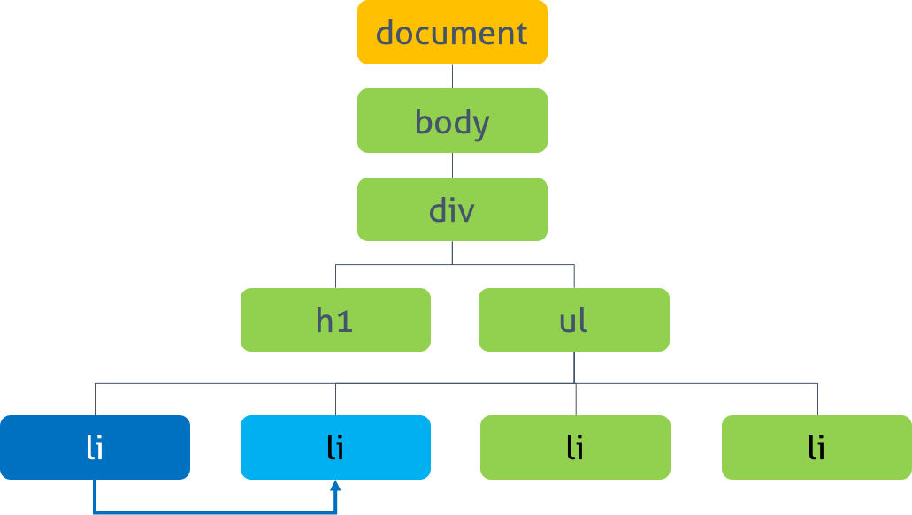

## 5.25 날짜와 시간을 위한 Date 객체 

Date 객체는 날짜와 시간을 위한 메소드를 제공하는 빌트인 객체이면서 생성자 함수


### 1. Date Constructor

Date 생성자 함수로 객체를 생성하는 방법은 4가지가 있다.


- 종류 : 
  1. new Date()
  2. new Date(milliseconds)
  3. new Date(dateString)
  4. new Date(year, month(, day, hour, minute, second, millisecond))


#### 1.1 new Date() 

인수를 전달하지 않으면 현재 날짜와 시간을 가지는 인스턴스를 반환한다.

```javascript
const date = new Date();
console.log(date); // Thu May 16 2019 17:16:13 GMT+0900 (한국 표준시)
```


#### 1.2 new Date(milliseconds)

인수로 숫자 타입의 밀리초를 전달하면 1970년 1월 1일 00:00(UTC)을 기점으로 인수로 전달된 밀리초만큼 경과한 날짜와 시간을 가지는 인스턴스를 반환한다.

```javascript
let date = new Date(0);
console.log(date) // Thu Jan 01 1970 09:00:00 GMT+0900 (한국 표준시)

date = new Data(86400000);
console.log(date); // FFri Jan 02 1970 09:00:00 GMT+0900 (한국 표준시)
```


#### 1.3 new Date(dateString)

인수로 날짜와 시간을 나타내는 문자열을 전달하면 지정된 날짜와 시간을 가지는 인스턴스를 반환한다.

인수로 전달한 문자열은 Date.parse 메소드에 의해 해석 가능한 형식이어야 함.

```javascript
let date = new Date('May 16, 2019 17:22:10');
console.log(date); // Thu May 16 2019 17:22:10 GMT+0900 (한국 표준시)

date = new Date('2019/05/16.17:22:10');
console.log(date); // // Thu May 16 2019 17:22:10 GMT+0900 (한국 표준시)
```


#### 1.4 new Date(year, month[, day, hour, minute, second, millisecond])

인수로 년, 월 , 일, 시, 분, 초, 밀리초를 의미하는 숫자를 전달하면 지정된 날짜와 시간을 가지는 인스턴스를 반환한다. 

```javascript
let date = new Date(2019, 4);
console.log(date); // Wed May 01 2019 00:00:00 GMT+0900 (한국 표준시)

date = new Date(2019, 4, 16, 17, 24, 30, 0);
console.log(date); // Thu May 16 2019 17:24:30 GMT+0900 (한국 표준시)

// 가독성이 훨씬 좋다.
date = new Date(;2019/5/16/17:24:30:10');
console.log(date); // Thu May 16 2019 17:24:30 GMT+0900 (한국 표준시)
```


#### 1.5 Date 생성자 함수를 new 연산자 없이 호출

Date. 생성자 함수를 new  연산자없이 호출하면 인스턴스를 반환하지 않고 결과값을 문자열로 반환한다.

```javascript
let date = Date();
console.log(typeof date, date); // string Thu May 16 2019 17:33:03 GMT+0900 (한국 표준시)
```


### 2. Date 메소드


#### 2.1 Date.now

 1970년 1월 1일 00:00:00(UTC)을 기점으로 현재 시간까지 경과한 밀리초를 숫자로 반환한다. 

```javascript
const now = Date.now();
console.log(now);
```


#### 2.2 Date.parse

1970년 1월 1일 00:00: 00(UTC)을 기점으로 인수로 전달된 지정 시간가지의 밀리초를 숫자로 반환한다.

```javascript
let d = Date.parse('Jan 2, 1970 00:00:00 UTC'); // UTC
console.log(d); // 86400000

d = Date.parse('Jan 2, 1970 09:00:00'); // KST
console.log(d); // 86400000

d = Date.parse('1970/01/02/09:00:00'); // KST
console.log(d); // 86400000
```


#### 2.3 Date.UTC

1970년 1월 1일 00:00:00을 기점으로 인수로 전달된 지정 시간까지의 밀리초를 숫자로 반환함.

Date.UTC 메소드는 new Date(year, month[, day, hour, minute, second, millisecond]) 와 같은 형식의 인수를 사용해야됨.  Date.UTC 메소드의 인수는 local time(KST)가 아닌 UTC로 인식된다.


```javascript
let d = Date.UTC(1970 ,0, 2);
console.log(d); // 86400000

d = Date.UTC('1970/1/2');
console.log(d); // NaN
```


#### 2.4 Date.prototype.getFullYear

년도를 나타내는 4자리 숫자를 반환한다.

```javascript
const today = new Date();
const year = today.getFullYear();

console.log(today); // Thu May 16 2019 17:39:30 GMT+0900 (한국 표준시)
console.log(year); // 2019

```


#### 2.5 Date.prototype.setFullYear

년도를 나타내는 4자리 숫자를 설정한다. 년도 이외 월, 일도 설정할 수 있다.

```javascript
dateObj.setFullYear(year[, month[, day]]) 

const today = new Date();

// 년도 지정
today.setFullYear(2000);

let year = today.getFullYear();
console.log(today); // Tue May 16 2000 17:42:40 GMT+0900 (한국 표준시)
console.log(year); // 2000

// 년도 지정
today.setFullYear(1900, 0, 1);

year = today.getFullYear();
console.log(today); // Mon Jan 01 1900 17:42:40 GMT+0827 (한국 표준시)
console.log(year); // 1900

```

#### 

#### 2.6 Date.prototype.getMonth

월을 나타내는 0 ~ 11의 정수를 반환한다. 1월은 0, 12월은 11이다.

```javascript
const today = new Date();
const month = today.getMonth();

console.log(today); // Thu May 16 2019 17:44:03 GMT+0900 (한국 표준시)
console.log(month); // 4

```


#### 2.7 Date.prototype.setMonth

월을 나타내는 0 ~ 11의 정수를 설정한다. 1월은 0, 12월은 11이다. 월 이외 일도 설정할 수 있다.

```javascript
dateObj.setMonth(month[, day])

const today = new Date();

//월을 지정 
today.setMonth(0); // 1월

let month = today.getMonth();
console.log(today); // // Wed Jan 16 2019 17:45:20 GMT+0900 (한국 표준시)
console.log(month); // 0

// 월/일을 지정
today.setMotnh(11, 1); // 12월 1일

month = today.getMonth();
console.log(today); //  Sun Dec 01 2019 17:45:20 GMT+0900 (한국 표준시)
console.log(month); // 11

```


#### 2.8 Date.prototype.getDate

날짜 (1 ~ 31)를 나타내는 정수를 반환한다.

```javascript
const today = new Date();
const date = today.getDate();

console.log(today); // Thu May 16 2019 17:46:42 GMT+0900 (한국 표준시)
console.log(date); // 16

```

#### 

#### 2.9 Date.prototype.setDate

날짜(1 ~ 31)를 나타내는 정수를 설정한다.

```javascript
const today = new Date();

// 날짜 지정
today.setDate(1);

const date = today.getDate();
console.log(today); // Wed May 01 2019 17:47:01 GMT+0900 (한국 표준시)
console.log(date); // 1

```


#### 2.10 Date.prototype.getDay

요일 (0 ~ 6)를 나타내는 정수를 반환한다. 반환값은 아래와 같다.

|  요일  | 반환값 |
| :----: | :----: |
| 일요일 |   0    |
| 월요일 |   1    |
| 화요일 |   2    |
| 수요일 |   3    |
| 목요일 |   4    |
| 금요일 |   5    |
| 토요일 |   6    |

```javascript
const today = new Date();
const day = today.getDay();

console.log(today); // Thu May 16 2019 17:47:31 GMT+0900 (한국 표준시)
console.log(day); // 4

```


#### 2.11 Date.prototype.getHours

시간 (0 ~ 23)를 나타내는 정수를 반환한다.

```javascript
const today = new Date();
const hours = today.getHours();

console.log(today); // Thu May 16 2019 17:48:03 GMT+0900 (한국 표준시)
console.log(hours); // 17

```


#### 2.12 Date.prototype.setHours

시간 (0 ~ 23)를 나타내는 정수를 설정한다. 시간 이외 분, 초 밀리초도 설정할 수 있다.

```javascript
const today = new Date();

// 시간 지정
today.setHours(7);

let hours = today.getHours();
console.log(today); // // Thu May 16 2019 07:49:06 GMT+0900 (한국 표준시)
console.log(hours); // 7

// 시간, 분, 초, 밀리초 지정
today.setHours(0, 0, 0, 0);

hours = today.getHours();
console.log(today); // Thu May 16 2019 00:00:00 GMT+0900 (한국 표준시)
console.log(hours); // 0

```


#### 2.13 Date.prototype.getMinutes

분 (0 ~ 59)를 나타내는 정수를 반환한다.

```javascript
const today = new Date();
const minutes = today.getMinutes();

console.log(today); // Thu May 16 2019 17:50:29 GMT+0900 (한국 표준시)
console.log(minutes); // 50

```


#### 2.14 Date.prototype.setMinutes

분 (0 ~ 59)를 나타내는 정수를 설정한다. 분 이외 초, 밀리초도 설정할 수 있다.

```javascript
const today = new Date();

// 분 지정
today.setMinutes(50);

let minutes = today.getMinutes();
console.log(today);   // Thu May 16 2019 17:50:30 GMT+0900 (한국 표준시)
console.log(minutes); // 50

// 분/초/밀리초 지정
today.setMinutes(5, 10, 999); // HH:05:10:999

minutes = today.getMinutes();
console.log(today);   // Thu May 16 2019 17:05:10 GMT+0900 (한국 표준시)
console.log(minutes); // 5

```


#### 2.15 Date.prototype.getSeconds

초를 나타내는 정수를 반환한다.

```javascript
const today = new Date();
const seconds = today.getSeconds();

console.log(today); // Thu May 16 2019 17:53:17 GMT+0900 (한국 표준시)
console.log(seconds); // 17 

```


#### 2.16 Date.prototype.setSeconds

초를 나타내는 정수를 설정한다. 초 이외 밀리초도 설정할 수 있다.

```javascript
const today = new Date();

// 초 지정
today.setSeconds(30);

let seconds = today.getSeconds();
console.log(today);   // Thu May 16 2019 17:54:30 GMT+0900 (한국 표준시)
console.log(seconds); // 30

// 초/밀리초 지정
today.setSeconds(10, 0); // HH:MM:10:000

seconds = today.getSeconds();
console.log(today);   // Thu May 16 2019 17:54:10 GMT+0900 (한국 표준시)
console.log(seconds); // 10

```


#### 2.17 Date.prototype.getMilliseconds

밀리초를 나타내는 정수를 반환한다.

```javascript
const today = new Date();
const ms = today.getMilliseconds();

console.log(today);
console.log(ms);

```


#### 2.18 Date.prototype.setMilliseconds

밀리초를 나타내는 정수를 설정한다.

```javascript
const today = new Date();

// 밀리초 지정
today.setMilliseconds(123);

const ms = today.getMilliseconds();
console.log(today); // Thu May 16 2019 17:55:45 GMT+0900 (한국 표준시)
console.log(ms);    // 123

```


#### 2.19 Date.prototype.getTime

 1970년 1월 1일 00:00:00(UTC)를 기점으로 현재 시간까지 경과된 밀리초를 반환한다. 

```javascript
const today = new Date();
const time = today.getTime();

console.log(today); // Thu May 16 2019 17:56:08 GMT+0900 (한국 표준시)
console.log(time); // 1557996968335

```


#### 2.20 Date.prototype.setTime

1970년 1월 1일 00:00:00(UTC)를 기점으로 현재 시간까지 경과된 밀리초를 설정한다.

```javascript
const today = new Date();

today.setTime(86400000);

const time = today.getTime();
console.log(today); // Fri Jan 02 1970 09:00:00 GMT+0900 (한국 표준시)
console.log(time); // 86400000


```


#### 2.21 Date.prototype.getTimezoneOffset

UTC와 지정 로케일 시간과의 차이를 분단위로 반환한다.


#### 2.22 Date.prototype.toDateString

사람이 읽을 수 있는 형식의 문자열로 날짜를 반환한다.


#### 2.24 Date.prototype.toTimeString

사람이 읽을 수 있는 형식의 문자열로 시간을 반환한다.

----------------

## 5.27 String 레퍼 객체

String 객체는 원시 타입인 문자열을 다룰 때 유용한 프로퍼티와 메소드를 제공하는 레퍼(wrapper) 객체이다. 

변수 또는 객체 프로퍼티가 문자열을 값으로 가지고 잇다면 String 객체의 별도 생성 없이 String 객체의 프로퍼티와 메소드를 사용할 수 있다.

원시 타입이 wrapper 객체의 메소드를 사용할 수 있는 이유는 원시 타입으로 프로퍼티나 메소드를 호출할 때 원시 타입과 연관된 wrapper 객체로 일시적으로 변환되어 프로토타입 객체를 공유하게 되기 때문이다.


```javascript
const str = 'Hello world!';
console.log(str.toUpperCase()); // 'HELLO WORLD!'
```


### 1. String Constructor

String 객체는 String 생성자 함수를 통해 생성할 수 있다. 이때 전달된 인자는 모두 문자열로 변환된다.

```
new String(value);

let strObj = new String('Lee'); 
console.log(strObj); // String {0: 'L', 1: 'e', 2: 'e', length: 3, [[PrimitiveValue]]: 'Lee'}
```


new 연산자를 사용하지 않고 String 생성자 함수 호출하면 String 객체가 아닌 문자열 리터럴을 반환함

```javascript
var x = String('Lee');

console.log(typeof x, x); // string Lee
```


일반적으로 문자열을 사용할 때는 원시 타입 문자열을 사용

```javascript
const str = 'Lee';
const strObj = new String('Lee');

console.log(str == strObj); // true
console.log(str === strObj); // false

console.log(typeof str); // string
console.log(typeof strObj); //object
```


### 2. String Property 


#### 2.1 String.length

문자열 내의 문자 갯수를 반환한다. String 객체는 length 프로퍼티를 소유하고 있으므로 유사 배열 객체이다.

```javascript
const str1 = 'Hello';
console.log(str1.length); // 5

const str2 = '안녕하세요!';
console.log(str2.length); // 6
```


### 3. String Method

String 객체의 모든 메소드는 언제나 새로운 문자열을 반환한다. 문자열은 변경 불가능한 원시 값이기 때문이다.


#### 3.1 String.prototype.charAt(pos: number): string

인수로 전달한 index를 사용하여 index에 해당하는 위치의 문자를 반환한다.

index는 0 ~ (문자열 길이 -1) 사이의 정수이다. 

지정한 index가 문자열의 범위 (0 ~ (문자열 길이 -1))를 벗어난 경우 빈문자열을 반환한다.

```javascript
const str = 'Hello';

console.log(str.charAt(0)); // H
console.log(str.charAt(1)); // e
console.log(str.charAt(5)); // ''
```


#### 3.2 String.prototype.concat(...strings: string[]): string

인수로 전달한 1개 이상의 문자열과 연결하여 새로운 문자열을 반환한다.

concat 메소드를 사용하는 것보다는 +. += 할당 연산자를 사용하는 것이 성능상 유리하다.

```javascript
console.log('Hello '.concat('Lee')); //Hello Lee
```


#### 3.3 String.prototype.indexOf(searchString: string, fromIndex = 0):number

인수로 전달한 문자 또는 문자열을 대상 문자열에서 검색하여 처음 발견된 곳의 index를 반환한다.

발견하지 못한 경우 -1을 반환한다.


```javascript
const str = 'Hello World';

console.log(str.indexOf('l')); // 2
console.log(str.indexOf('or')); // 7
console.log(str.indexOf('or' , 8)); // -1
```


#### 3.4 String.prototype.lastIndexOf(searchString: string, fromIndex=this.length-1): number

인수로 전달한 문자 또는 문자열을 대상 문자열에서 검색하여 마지막으로 발견된 곳의 index를 반환한다. 발견하지 못한 경우 -1을 반환한다.


2번째 인수(fromIndex)가 전달되면 검색 시작 위치를 fromIndex으로 이동하여 역방향으로 검색을 시작한다. 이때 검색 범위는 0 ~ fromIndex이며 반환값은 indexOf 메소드와 동일하게 발견된 곳의 index


```javascript
const str = 'Hello World';

console.log(str.lastIndexOf('World')); // 6
console.log(str.lastIndexOf('l')); // 9

console.log(str.lastIndexOf('o', 5)); // 4
console.log(str.lastIndexOf('l', 10)); // 9

```


#### 3.5 String.prototype.replace(searchValue: string | RegExp, replaceValue: string | replacer: (substring: string, …args: any[]) => string): string): string

첫번째 인수로 전달한 문자열 또는 정규 표현식을 대상 문자열에서 검색하여 두번째 인수로 전달한 문자열로 대체한다. 우너본 문자열은 변경되지 않고 결과가 반영된 새로문 문자열에 반환한다.


검색된 문자열이 여럿 존재할 경우 첫번째로 검색된 문자열만 대체된다.


```javascript
const str = 'Hello world';

// 첫번째로 검색된 문자열만 대체하여 새로운 문자열을 반환한다.
console.log(str.replace('world', 'Lee')); // Hello Lee

// 특수한 교체 패턴을 사용할 수 있다. ($& => 검색된 문자열)
console.log(str.replace('world', '<strong>$&</strong>')); // Hello <strong>world</strong>

/* 정규표현식
g(Global): 문자열 내의 모든 패턴을 검색한다.
i(Ignore case): 대소문자를 구별하지 않고 검색한다.
*/
console.log(str.replace(/hello/gi, 'Lee')); // Lee Lee

// 두번째 인수로 치환 함수를 전달할 수 있다.
// camelCase => snake_case
const camelCase = 'helloWorld';
console.log(camelCase.replace(/[\w][A-Z]/g, function (match) {
  console.log(match);
  // match : oW => match[0] : o, match[1] : W
  return match[0] + '_' + match[1].toLowerCase();
})); // hello_world

// snake_case => camelCase
const snakeCase = 'hello_world';
console.log(snakeCase.replace(/_\w/g, function (match) {
  // match : _w => match[1] : w
  return match[1].toUpperCase();
})); // helloWorld

```


#### 3.6 String.prototype.split(separator: string | RegExp, limit?: number): string[]

첫번째 인수로 전달한 문자열 또는 정규표현식을 대상 문자열에서 검색하여 문자열을 구분한 후 분리된 각 문자열로 이루어진 배열을 반환한다. 원본 문자열은 변경되지 않는다.

인수가 없는 경우, 대상 문자열 전체를 단일 요소로 하는 배열을 반환한다.

```javascript
const str = 'How are you doing?';

// 공백으로 구분(단어로 구분)하여 배열로 반환한다
console.log(str.split(' ')); // [ 'How', 'are', 'you', 'doing?' ]

// 인수가 없는 경우, 대상 문자열 전체를 단일 요소로 하는 배열을 반환한다.
console.log(str.split()); // [ 'How are you doing?' ]

// 각 문자를 모두 분리한다
console.log(str.split('')); // [ 'H','o','w',' ','a','r','e',' ','y','o','u',' ','d','o','i','n','g','?' ]

```


#### 3.7 String.prototype.substring(start: number, end=this.length): string

첫번재 인수로 전달한 start  인덱스에 해당하는 문장부터 두번째 인자에 전달된 end 인덱스에 해당하는 문자의 바로 이전 문자까지를 모두 반환한다. 이때 첫번째 인수 < 두번째 인수의 관계가 성립된다.


- 첫번째 인수 > 두번째 인수 : 두 인수는 교환된다.
- 두번째 인수가 생략된 경우 : 해당 문자열의 끝까지 반환한다.
- 인수 < 0 또는 NaN인 경우 : 0으로 취급된다.
- 인수 > 문자열의 길이(str.length) : 인수는 문자열의 길이(str.length)으로 취급된다.


```javascript
const str = 'Hello World'; // str.length == 11

console.log(str.substring(1, 4)); // ell

// 첫번째 인수 > 두번째 인수 : 두 인수는 교환된다.
console.log(str.substring(4, 1)); // ell

// 두번째 인수가 생략된 경우 : 해당 문자열의 끝까지 반환한다.
console.log(str.substring(4)); // o World

// 인수 < 0 또는 NaN인 경우 : 0으로 취급된다.
console.log(str.substring(-2)); // Hello World

// 인수 > 문자열의 길이(str.length) : 인수는 문자열의 길이(str.length)으로 취급된다.
console.log(str.substring(1, 12)); // ello World
console.log(str.substring(11)); // ''
console.log(str.substring(20)); // ''
console.log(str.substring(0, str.indexOf(' '))); // 'Hello'
console.log(str.substring(str.indexOf(' ') + 1, str.length)); // 'World'

```


#### 3.8 String.prototype.slice(start?: number, end?: number): string

String.prototype.substring과 동일하다. 단, String.prototype.slice는 음수의 인수를 전달할 수 있다.

```javascript
const str = 'hello world';

// 인수 < 0 또는 NaN인 경우 : 0으로 취급된다.
console.log(str.substring(-5)); // 'hello world'
// 뒤에서 5자리를 잘라내어 반환한다.
console.log(str.slice(-5)); // 'world'

// 2번째부터 마지막 문자까지 잘라내어 반환
console.log(str.substring(2)); // llo world
console.log(str.slice(2)); // llo world

```


#### 3.9 String.prototype.toLowCase(): string

대상 문자열의 모든 문자를 소문자로 변경한다.

```javascript
console.log('Hello world!'.toLowerCase()); // hello world!

```


#### 3.10 String.prototype.toUpperCase(): string

대상 문자열의 모든 문자를 대문자로 변경한다.

```javascript
console.log('Hello World!').toUpperCase()); // HELLO WORLD!

```


#### 3.11 String.prototype.trim(): string

대상 문자열 양쪽 긑에 잇는 공백 문자를 제거한 문자열을 반환한다.

```javascript
const str = '   foo  ';
console.log(str.trim()); // 'foo'

```


#### 3.12 String.prototype.repeat(count: number): string

인수로 전달한 숫자만큼 반복해 연결한 새로운 문자열을 반환한다. 

 count가 0이면 빈 문자열을 반환하고 음수면 RangeError를 발생시킨다.

```javascript
console.log('abc'.repeat(0));   // ''
console.log('abc'.repeat(1));   // 'abc'
console.log('abc'.repeat(2));   // 'abcabc'
console.log('abc'.repeat(2.5)); // 'abcabc' (2.5 → 2)
console.log('abc'.repeat(-1));  // RangeError: Invalid count value

```


#### 3.13 String.prototype.includes(searchString: string, position?: number): boolean 

인수로 전달한 문자열이 포함되어 있는지를 검사하고 결과를 불리언 값으로 반환한다. 두번째 인수는 옵션으로 검색할 위치를 나타내는 정수이다. 

```javascript
const str = 'hello world';

console.log(str.includes('hello')); // true
console.log(str.includes(' '));     // true
console.log(str.includes('wo'));    // true
console.log(str.includes('wow'));   // false
console.log(str.includes(''));      // true
console.log(str.includes());        // false

// String​.prototype​.indexOf 메소드로 대체할 수 있다.
console.log(str.indexOf('hello')); // 0

```

--------------------------

## 30. 문서 객체 모델(Document Object Model)

### 1. DOM

- 정의 : 
  1. 브라우저의 렌더링 엔진이 웹 문서를 로드한후, 파싱하여 웹 문서를 브라우저가 이해할 수 있는 구조로 구성하여 메모리에 적재하는 것을 DOM이라 함
  2. 모든 요소와 요소의 어트리뷰트, 텍스트를 각각의 객체로 만들고 이들 객체를 부자 관계를 표현할 수 있는 트리 구조로 구성한것


- 특징 : 
  1. DOM은 프로그래밍 언어가 자신에 접근하고 수정할 수 있는 방법을 제공하는데 일반적으로 프로퍼티와 메소드를 갖는 자바스크립트 객체로 제공됨. (DOM API)
  2. 정적인 웹 페이지에 접근하여 동적으로 웹페이지를 변경하기 위한 유일한 방법은 메모리 상에 존재하는 DOM을 변경하는 것이고, 이때 필요한 것이 DOM에 접근하고 변경하는 프로퍼티와 메소드의 집합인 DOM API


- 역할 : 
  1. HTML 문서에 대한 모델 구성
  2. HTML 문서 내의 각 요소에 접근 / 수정


### 2. DOM tree

- 의미 : 브라우저가 HTML 문서를 로드한 후 파싱하여 생성하는 모델을 의미

```html
<!DOCTYPE html>
<html>
	<head>
		<style>
			.red { color: #ff0000; }
			.blue { color: #0000ff; }
		</style>
	<head>
	<body>
		<div>
			<h1>Cities</h1>
			<ul>
				<li id = "one" class="red">Seoul</li>
				<li id = "two" class="red">London</li>
				<li id = "three" class="red">Newyork</li>
				<li id = "four" class="red">Newyork</li>
			</ul>
		<div>
	</body>
</html>

```


- DOM tree를 보고 알수 있는것
  1. DOM 에서 모든 요소, 어트리뷰트, 텍스트는 하나의 객체이며 Document 객체의 자식이다.
  2. 요소의 중첩관계는 객체의 트리로 구조화하여 부자관계를 표현한다.
  3. DOM tree의 진입점은 document 객체이며 최종점은 요소의 텍스트를 나타내는 객체이다.


- DOM tree의 4가지 구성

  1. 문서 노드 

     트리의 최상위에 존재하며 각 요소, 어트리뷰트, 텍스트 노드에 접근하려면 문서 노드를 통해야 한다. 즉, DOM tree에 접근하기 위한 시작점이다.

  2. 요소 노드

     요소 노드는 HTML 요소를 표현한다. HTML 요소는 중첩에 의해 부자 관계를 가지며 이 부자 관계를 통해 정보를 구조화한다. 

  3. 어트리뷰트 노드

     어트리뷰트 노드는 HTML 요소의 어트리뷰트를 표현한다. 어트리뷰트 노드는 해당 어트리뷰트가 지정된 요소의 자식이 아니라 해당 요소의 일부로 표현된다. 

  4. 텍스트 노드

     텍스트 노드는 HTML 요소의 텍스트를 표현한다. 텍스트 노드는 요소 노드의 자식이며 자신의 자식 노드를 가질 수 없다. 


-  DOM을 통해 웹페이지를 조작하기 위한 순서

  1. 조작하고자 하는 요소를 선택 또는 탐색한다.
  2. 선택된 요소의 콘텐츠 또는 어트리뷰트를 조작한다.

  

### 3. DOM Query / Traversing (요소에의 접근)


#### 3.1 하나의 요소 노드 선택(DOM Query)


- document.getElementById(id)
  - id 어트리뷰트 값으로 요소 노드를 한개 선택한다. 복수개가 선택된 경우, 첫번째 요소만 반환한다.
  - Return: HTMLElement를 상속받은 객체
  - 모든 브라우저에서 동작
- document.querySelector(cssSelector)
  - CSS 셀렉터를 사용하여 요소 노드를 한 개 선택한다. 복수개가 선택된 경우, 첫번째 요소만 반환한다.
  - Return: HTMLElement를 상속받은 객체
  - IE8 이상의 브라우저에서 동작


#### 3.2 여러 개의 요소 노드 선택(DOM Query)


- document.getElementsByClassName(class)
  - class 어트리뷰트 값으로 요소 노드를 모두 선택한다. 공백으로 구분하여 여러 개의 class를 지정할 수 있다.
  - Return: HTMLCollection (live)
  - IE9 이상의 브라우저에서 동작


- document.getElementsByTagName(tagName)
  - 태그명으로 요소 노드를 모두 선택한다.
  - Return: HTMLCollection (live)
  - 모든 브라우저에서 동작


- document.querySelectorAll(selector)
  - 지정된 CSS 선택자를 사용하여 요소 노드를 모두 선택한다.
  - Return: NodeList(non-live)
  - IE8 이상의 브라우저에서 동작


#### 3.3 DOM Traversing (탐색)



- parentNode
  - 부모 노드를 탐색한다.
  - Return: HTMLElement를 상속받은 객체
  - 모든 브라우저에서 동작


- firstChild, lastChild
  - 자식 노드를 탐색한다.
  - Return: HTMLElement를 상속받은 객체
  - IE9 이상의 브라우저에서 동작


- hasChildNodes()
  - 자식 노드가 있는지 확인하고 Boolean 값을 반환한다.
  - Return: Boolean 값
  - 모든 브라우저에서 동작


- childNodes
  - 자식 노드의 컬렉션을 반환한다. 텍스트 요소를 포함한 모든 자식 요소를 반환한다.
  - Return: NodeList(non-live)
  - 모든 브라우저에서 동작


- children
  - 자식 노드의 컬렉션을 반환한다. 자식 요소 중에서 Element type 요소만을 반환한다.
  - Return: HTMLCollection(live)
  - IE9 이상의 브라우저에서 동작


- previousSibling, nextSibling
  - 형제 노드를 탐색한다. text node를 포함한 모든 형제 노드를 탐색한다.
  - Return: HTMLElement를 상속받은 객체
  - 모든 브라우저에서 동작


- previousElementSibling, nextElementSibling
  - 형제 노드를 탐색한다. 형제 노드 중에서 Element type 요소만을 탐색한다.
  - Return: HTMLElement를 상속받은 객체
  - IE9 이상의 브라우저에서 동작


### 4. DOM Manipulation (조작)

#### 

#### 4.1 텍스트 노드에의 접근 / 수정


- 텍스트 노드에 접근하기위한 순서
  1. 해당 텍스트 노드의 부모 노드를 선택한다. 텍스트 노드는 요소 노드의 자식이다.
  2. firstChild 프로퍼티를 사용하여 텍스트 노드를 탐색한다.
  3. 텍스트 노드의 유일한 프로퍼티(nodeValue)를 이용하여 텍스트를 취득한다.
  4. nodeValue를 이용하여 텍스트를 수정한다.


- nodeValue
  - 노드의 값을 반환한다.
  - Return: 텍스트 노드의 경우 문자열, 요소 노드의 경우 null 반환
  - IE6 이상의 브라우저에서 동작한다.


#### 4.2 어트리뷰트 노드에의 접근 / 수정


- className
  - class 어트리뷰트의 값을 취득 또는 변경한다. className 프로퍼티에 값을 할당하는 경우, class  어트리뷰트가 존재하지 않으면 class 어트리뷰트를 생성하고 지정된 값을 설정한다.  class 어트리뷰트의 값이 여러 개일 경우, 공백으로 구분된 문자열이 반환되므로 String 메소드 split(‘ ’)를 사용하여 배열로 변경하여 사용한다.
  - 모든 브라우저에서 동작한다.


- classList
  - add, remove, item, toggle, contains, replace 메소드를 제공한다.
  - IE10 이상의 브라우저에서 동작한다.


- id
  - id 어트리뷰트의 값을 취득 또는 변경한다. id 프로퍼티에 값을 할당하는 경우, id 어트리뷰트가 존재하지 않으면 id 어트리뷰트를 생성하고 지정된 값을 설정한다.
  - 모든 브라우저에서 동작한다.


- hasAttribute(attribute)
  - 지정한 어트리뷰트를 가지고 있는지 검사한다.
  - Return: Boolean
  - IE8 이상의 브라우저에서 동작한다.


- getAttribute(attribute)
  - 어트리뷰트의 값을 취득한다.
  - Return: 문자열
  - 모든 브라우저에서 동작한다.


- setAttribtue(attribute, value)
  - 어트리뷰트와 어트리뷰트 값을 설정한다.
  - Return: undefined
  - 모든 브라우저에서 동작한다.


- removeAttribute(attribute)
  - 지정한 어트리뷰트를 제거한다.
  - Return : undefined
  - 모든 브라우저에서 동작한다.


#### 4.3 HTML 콘텐츠 조작(Manipulation)


- testContent
  - 요소의 텍스트 콘텐츠를 취득 또는 변경한다. 이때 마크업은 무시된다. textContent를 통해 요소에 새로운 텍스트를 할당하면 텍스트를 변경할 수 있다. 이때 순수한 텍스트만 지정해야 하며 마크업을 포함시키면 문자열로 인식되어 그대로 출력된다.
  - IE9 이상의 브라우저에서 동작한다.
- innerText
  - innerText 프로퍼티를 사용하여도 요소의 텍스트 콘텐츠에만 접근할 수 있다. 하지만 아래의 이유로 사용하지 않는것이 좋다.
    - 비표준이다.
    - CSS에 순종적임
    - CSS를 고려해야 하므로 textContent 프로퍼티보다 느리다.


- innerHTML

  - 해당 요소의 모든 자식 요소를 포함하는 모든 콘텐츠를 하나의 문자열로 취득할 수 있다.

    이문자열은 마크업을 포함한다.

  

#### 4.4 DOM 조작 방식


- DOM 에서 한 개의 요소를 추가하는 경우의 수순

  1. 요소 노드 생성 createElement() 메소드를 사용하여 새로운 요소 노드를 생성한다.

     createElement() 메소드의 인자로 태그 이름을 전달함

  2. 텍스트 노드 생성 createTextNode() 메소드를 사용하여 새로운 텍스트 노드를 생성한다. 경우에 따라 생략될 수 있지만 생략하는 경우, 콘텐츠가 비어있는 요소가 된다.

  3. 생성된 요소를 DOM에 추가 appendChild() 메소드를 사용하여 생성된 노드를 DOM tree에 추가한다. 또는 removeChild() 메소드를 사용하여 DOM tree에서 노드를 삭제할 수도 있다.


- createTextNode(text)
  - 텍스트를 인자로 전달하여 텍스트 노드를 생성한다.
  - Return: Text 객체
  - 모든 브라우저에서 동작한다.


- appendChild(Node)
  - 인자로 전달한 노드를 마지막 자식 요소로 DOM 트리에 추가한다.
  - Return: 추가한 노드
  - 모든 브라우저에서 동작한다.


- removeChild(Node)
  - 인자로 전달한 노드를 DOM 트리에 제거한다.
  - Return: 추가한 노드
  - 모든 브라우저에서 동작한다.


#### 4.5 insertAdjacentHTML()


- insertAdjacentHTML(position, string)
  - 인자로 전달한 텍스트를 HTML로 파싱하고 그 결과로 생성된 노드를 DOM 트리의 지정된 위치에 삽입한다. 첫번째 인자는 삽입 위치, 두번째 인자는 삽입할 요소를 표현한 문자열이다. 
  - 모든 브라우저에서 동작한다.


#### 4.6 innerHTML vs DOM 조작 방식 vs insertAdjacentHTML() 


- innerHTML

| 장점                                                       | 단점                                                   |
| ---------------------------------------------------------- | ------------------------------------------------------ |
| DOM 조작 방식에 비해 빠르고 간편하다.                      | XSS 공격에 취약점이 있다.                              |
| 간편하게 문자열로 정의한 여러 요소를 DOM에 추가할 수 있다. | 해당 요소의 내용을 덮어 쓴다. 즉 HTML을 다시 파싱한다. |
| 콘텐츠를 취득할수 있다.                                    |                                                        |


- DOM 조작 방식

| 장점                                                         | 단점                                          |
| ------------------------------------------------------------ | --------------------------------------------- |
| 특정 노드 한 개(노드, 텍스트, 데이터 등)를 DOM에 추가할 때 적합하다. | innerHTML보다 느리고 더 많은 코드가 필요하다. |


- insertAdjacentHTML()

| 장점                                                       | 단점                |
| ---------------------------------------------------------- | ------------------- |
| 간편하게 문자열로 정의된 여러 요소를 DOM에 추가할 수 있다. | XSS 공격에 취약하다 |
| 삽입되는 위치를 선정할 수 있다.                            |                     |


- 결론 : 

  innerHTML과 insertAdjacentHTML()은 크로스 스크립팅 공격에 취약하다. 

  untrusted data의 경우, 주의하여야 한다. 텍스트를 추가 또는 변경시에는 textContent, 새로운 요소의 추가 또는 삭제시에는 DOM 조작 방식을 사용하도록 한다.

  

### 5. style


- window.getComputedStyle

  위 메소드는 인자로 주어진 요소의 모든 CSS 프로퍼티 값을 반환한다.

  